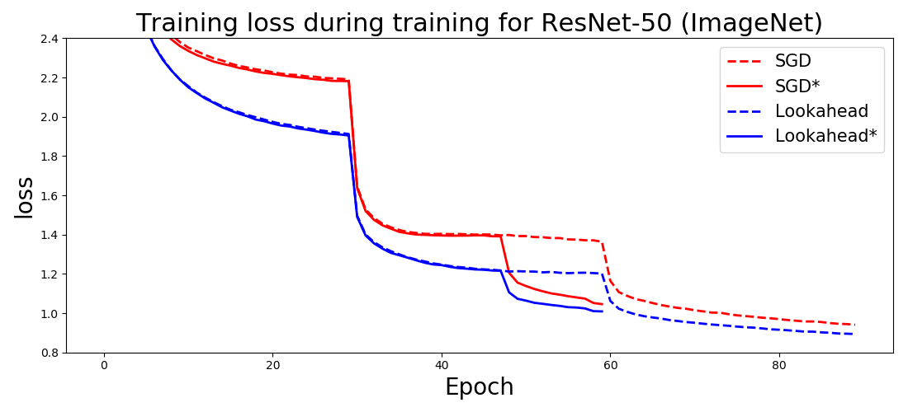

# SGD as a splitting scheme

$$
\begin{aligned}
% \label{strang:simple_GF_splitting}
&\qquad\text{Splitting step} &\text{Euler discretization} \\
&\frac{d \theta}{d t} = -\frac{1}{2}\nabla f_1(\theta) &\tilde{\theta}_{I} = \theta_0 - \frac{h}{2}\nabla f_1 (\theta_0) \\
&\frac{d \theta}{d t} = -\frac{1}{2}\nabla f_2(\theta) &\theta_{I} = \tilde{\theta}_{I} - \frac{h}{2}\nabla f_2 (\tilde{\theta}_{I})
\end{aligned}
$$

---
<!-- footer: SGD -->
# Optimization step with ODE solver

---

# Results

---
# bitman czar image

$$
\begin{aligned}
% \label{strang:simple_GF_splitting}
&\qquad\text{Splitting step} &\text{Euler discretization} \\
&\frac{d \theta}{d t} = -\frac{1}{2}\nabla f_1(\theta) &\tilde{\theta}_{I} = \theta_0 - \frac{h}{2}\nabla f_1 (\theta_0) \\
&\frac{d \theta}{d t} = -\frac{1}{2}\nabla f_2(\theta) &\theta_{I} = \tilde{\theta}_{I} - \frac{h}{2}\nabla f_2 (\tilde{\theta}_{I})
\end{aligned}
$$

